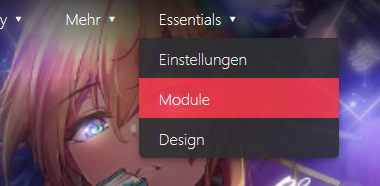
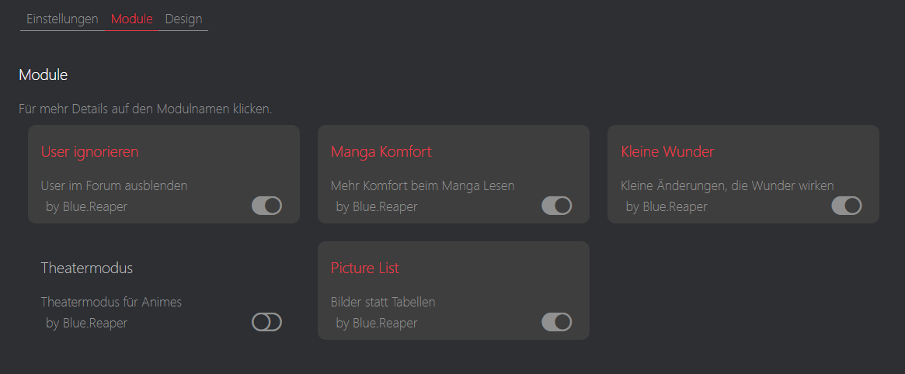

# Was ist Proxer Essentials?
Es ist ein Userscript in dem verschiedene Erweiterungen an Proxer.me in einzelnen Modulen zusammengefügt sind.
Dabei kann der Anwender viele nützlichen Funktionen in nur einem Script bekommen und bei Bedarf auch einzelne Module deaktiviern. 

Auch ein hinzufügen neuer Erweiterungen durch verschiedene Autoren ist dank des modularen Aufbaus sehr einfach und das Framework übernimmt bereits grundlegende Funktionen, wie das gesteuerte Aufrufen der Module und die Einstellungen für die Userscript-Manager.

# aktueller Umfang 

## Design
Das Design benutzt als Grundlage das Theme "Modern Dark" von xYata ([hier der Forumspost](https://proxer.me/forum/anwendungen/383233-theme-proxer-modern-dark)).

Es gab bereits einige Verbesserungen z.B.

* vollständige Firefox Unterstützung
* Überarbeitung der Animationen
* Farben sind einstellbar

Zu den Einstellungen kommt man oben im Menü unter "Essentials -> Design"

## Module

Module können einzeln abgeschaltet werden.

* ### [Kleine Wunder](modules/smallWonders.md)
* ### [Manga Komfort](modules/mangaComfort.md)
* ### [Picture List](modules/pictureList.md)
* ### [Theatermodus](modules/theatermodus.md)
* ### [User ignorieren](modules/ignoreUser.md)

## Release Notes
Die einzelnen Änderungen pro Release stehen [hier](https://github.com/Blue-Reaper/Proxer-Essentials/releases).
## Kompatibilität
* [Violentmonkey](https://violentmonkey.github.io/)
  * 
  * 
* [Tampermonkey](https://tampermonkey.net/)
  * 
  * 
* [Greasemonkey](https://www.greasespot.net/)
  * 

##### Dein Browser ist nicht dabei, oder ungetestet?
Dann probier es doch einfach aus und hilf Anderen indem du eine Rückmeldung gibst, wie es funktioniert.
