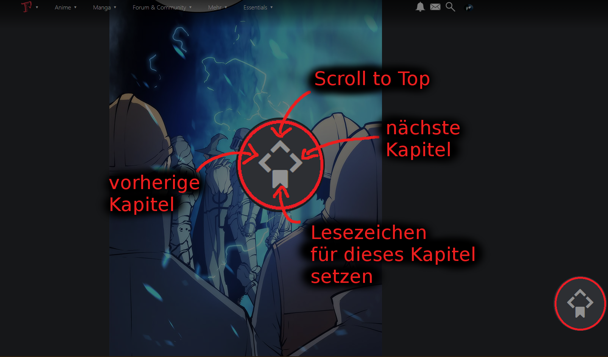

# Manga Komfort
##### Mehr Komfort beim Manga Lesen
## Funktion
+ Manga Navigation springt direkt zu den Bilden des nächsten Kapitels

+ Longstrip Reader
  + wird als Standard gesetzt
  + klick auf Bild scrollt zum nächsten Bild (Proxer Standard ist Sprung zu nächstem Kapitel)
+ Fügt `Mangaupdates` im Menü `Manga` und auf Startseite neben `Animeupdates` hinzu

[Zurück](../)
